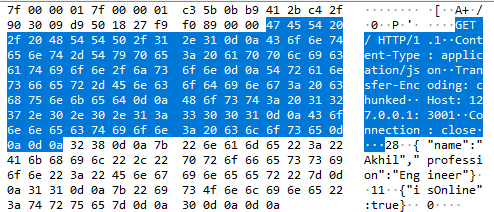

### HTTP - TCP relationship
**1) What is aim of this project ?**
- To show the relationship between HTTP which is an application layer protocol and TCP which is a transport layer protocol.

**2) What is misconception about http** 
- A common misconception is that HTTP is responsible for transporting data over the network between client and server. This is not true.
- HTTP is an application layer protocol and it is concerned with structure of data and not how data gets transported. 
- HTTP uses TCP which is a transport layer protocol.
- TCP is responsible for making the connection between client and server.
- This connection is a duplex stream which is used to transfer raw binary data over the network.
- When user types any URL in browser what happens is a TCP connection is setup between client(browser)
and server in the transport layer. 
- Then in application layer the browser forms a HTTP request. 
- This request will have a header part and body/payload part.
- Then this request is sent to server using TCP connection.
- The server is a HTTP server which parses the request.
- And forms a HTTP response and sends it to client using TCP connection.

**3) How to test the above ?**
- In order to test the above, I created a simple HTTP server and HTTP client using node.js
- I formed the following HTTP request and send it to the HTTP server using the HTTP client.

----START LINE AND HEADER PART---- 
GET / HTTP/1.1 
Content-Type: application/json 
Transfer-Encoding: chunked 
Host: 127.0.0.1:3001 
Connection: close 

----BODY/PAYLOAD PART---- 
{"name":"Akhil","profession":"Engineer"} 
{"isOnline":true} 

- I captured the HTTP request in wireshark and got the raw hex data (binary data) for start line, header and payload parts
- I used wireshark but any network analyzer tool can be used for this. Another popular alternative is fiddler.
- Then I created a TCP client and sent the raw hex data to the HTTP server and guess what ? 
- The server treated this like a normal HTTP request hence proving that HTTP works only when data is in a certain structure.

*HTTP/3 unlike its previous versions uses UDP which is another transport layer protocol responsible for transporting data.

**4) How to use the project ?**
- Install node.js in your system.
- Install a network analyzer tool in your system like wireshark, fiddler etc. In this project wireshark is used.
- Open a command prompt from root of project folder.
- Type the command 'node http-server.js' 
- This will start the http server on the loopback address 127.0.0.1 on port 3001.
- Open wireshark application and start capturing loopback traffic.
- Open another command prompt from root of project folder.
- Type the command 'node http-client.js'
- This will start the http client and send a http request to the http server.
- Check the command prompt in which http server is running. You will find that the server has parsed the request and printed out
headers, url, method and body/payload. 
- Below is the screenshot of the http request captured in wireshark.

- As you see in the above screenshot hexadecimal string of the request is also displayed. We know 4 bits in binary make up one 
hexadecimal digit. 

- Copy the hexadecimal strings (raw binary) for start line, header and body/payload parts of http request. 
start line and header hex stream:- 
474554202f20485454502f312e310d0a436f6e74656e742d547970653a206170706c69636174696f6e2f6a736f6e0d0a5472616e736665722d456e636f64696e673a206368756e6b65640d0a486f73743a203132372e302e302e313a333030310d0a436f6e6e656374696f6e3a20636c6f73650d0a0d0a 
body/payload hex stream:- 
32380d0a7b226e616d65223a22416b68696c222c2270726f66657373696f6e223a22456e67696e656572227d0d0a31310d0a7b2269734f6e6c696e65223a747275657d0d0a300d0a0d0a 

- Open another command prompt from root of project folder.
- Type the command 'node tcp-client'
- This will start a TCP client and this will send the raw binary data or hexadecimal string to the HTTP server. 
- Again check the command prompt in which HTTP server is running. You will find that it has parsed the data just like a normal
HTTP request and printed out the information.
